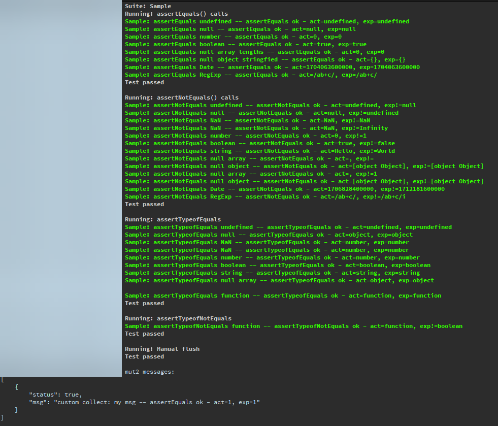

# MUT: Mini Unit Tests

This class is mainly intended to be used in [Directory Opus](https://www.gpsoft.com.au/) scripts. DOpus is an amazing,
indispensable file manager, but JScript hates tiny puppies, so this class can fix some of that via Unit Tests.

I am a huge fan of unit tests, and trying to get away from pure JScript development to TS transpiling,
as I originally intended but since I have to maintain some gigantic scripts until I can rewrite them,
I had to have a bit more help, so this little helper.

Copy and paste at the bottom of your script, and run your tests; ideally at script start obviously.

MUT follows the industry standard process:

* initialization via `var mut = new MUT({...})`
* an optional `mut.setup()` callback before every test
* multiple tests added via `mut.addTest(...)`
* an optional `mut.teardown()` callback after every test
* `mut.run()` to execute all tests

`options` can have the following keys:
* `name`: test suite name
* `abortOnErrors`: aborts as soon as any assertion fails
* `autoFlush`: flushes the messages after each assertion
* `skipSuccess`: success messages are not output or added to buffer
* `cbOut`: callback function for custom assertion handling (assertion failures cannot be supressed!)

the `cbOut`callback receives 2 parameters:

* `msg`: string
* `status`: boolean

where status is true for assertion success, false for failure and undefined for plain messages (e.g. for internal messages)

see below for example

*Note:* `.flush()` method is effective only within `.addTest()` methods, not outside

```javascript
var mut = new MUT({
    name: 'Sample',
    abortOnErrors: true,
    autoFlush: true
});
mut.setSetup(function() {
    // DOpus.output('set up test environment');
});
mut.setTeardown(function() {
    // DOpus.output('teardown test environment');
});
mut.addTest('assertEquals() calls', function () {
    mut.assertEquals(0, 0, 'assertEquals number');
});
mut.addTest('assertNotEquals() calls', function () {
    mut.assertNotEquals(undefined, null, 'assertNotEquals undefined');
})
mut.addTest('assertTypeofEquals', function () {
    mut.assertTypeofEquals(true, 'boolean', 'assertTypeofEquals boolean');
    });
});
mut.addTest('assertTypeofNotEquals', function() {
    mut.assertTypeofNotEquals(function () { }, 'boolean', 'assertTypeofNotEquals function');
});
mut.run();
```

## collecting messages
if you want to collect the messages first so you can filter them out with own logic
set both `autoFlush` & `skipSuccess` to FALSE, and pass a null function as callback
and do NOT call `.flush()` in any of the `.addTest()` methods

```javascript
var mut2 = new MUT({
    name: 'custom collect',
    abortOnErrors: true,
    autoFlush: false,
    skipSuccess: false,
    cbOut: function () { }
});
mut2.addTest('my test', function () {
    mut2.assertEquals(1, 1, 'my msg');
});
mut2.run();
DOpus.output('mut2 messages:\n' + JSON.stringify(mut2.getMessages(), null, 4));
```

 ## example for custom callback:
 ```javascript
    var mut3 = new MUT({
        name: 'cbex',
        abortOnErrors: true,
        autoFlush: true,
        cbOut: function(msg, status) {
            DOpus.output((msg !== undefined ? 'msg prefix: ' + msg : '') + (status !== undefined ? ', status: ' + status : ''));
        }
    });
 ```

More examples are directly in the script.

sprintf library originally by https://hexmen.com/js/sprintf.js, see https://hexmen.com/blog/2007/03/14/printf-sprintf/.

You should use the version supplied with this script if you do not want to adjust it to JScript yourself.

I may or may not add some .assertXYZ syntactic sugar methods in the future, e.g. .assertNotUndefined()...

## Output of the script-inline samples


## DISCLAIMER
I do not accept any liability, responsibility, whateverbility, you are on your own!**


Creative Commons Attribution-ShareAlike 4.0 International (CC BY-SA 4.0)

© 2024 cuneytyilmaz.com
